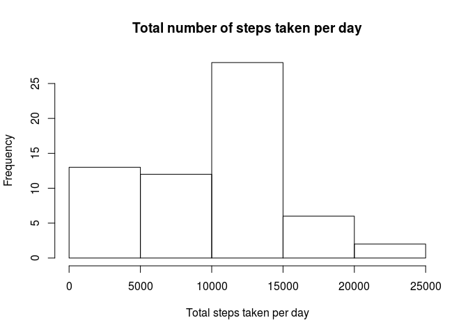
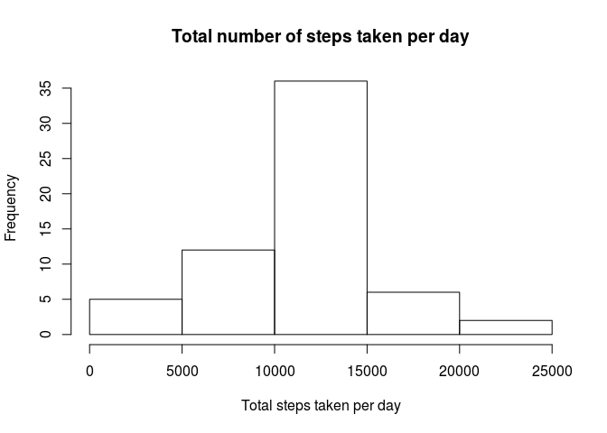
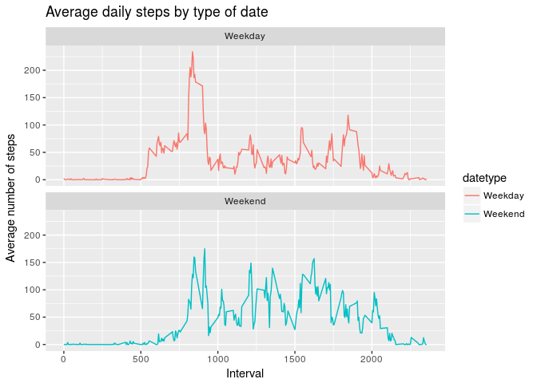

# PA1 tamplate
Reut Timor  
November 1, 2017  
turn warnings off


#Project 1 

The data for this assignment can be downloaded from the course web site:

Dataset: [Activity monitoring data] (https://d396qusza40orc.cloudfront.net/repdata%2Fdata%2Factivity.zip) [52K]

The variables included in this dataset are:

steps: Number of steps taking in a 5-minute interval (missing values are coded as NA) date: The date on which the measurement was taken in YYYY-MM-DD format interval: Identifier for the 5-minute interval in which measurement was taken The dataset is stored in a comma-separated-value (CSV) file and there are a total of 17,568 observations in this dataset.

##1. Code for reading in the dataset and preprocessing the data


```r
library(ggplot2)
library(data.table)
url<-"https://d396qusza40orc.cloudfront.net/repdata%2Fdata%2Factivity.zip"
download.file(url,"activity.zip")
unzip("activity.zip")
data_activ <- read.csv("activity.csv")
Sys.setenv(TZ="Europe/Berlin")
data_activ$date <- as.POSIXct(data_activ$date, "%Y-%m-%d")
weekday <- weekdays(data_activ$date)
data_activ <- cbind(data_activ,weekday)

summary(data_activ)
```

```
##      steps             date               interval       weekday    
##  Min.   :  0.00   Min.   :2012-10-01   Min.   :   0.0   חמישי:2592  
##  1st Qu.:  0.00   1st Qu.:2012-10-16   1st Qu.: 588.8   ראשון:2304  
##  Median :  0.00   Median :2012-10-31   Median :1177.5   רביעי:2592  
##  Mean   : 37.38   Mean   :2012-10-31   Mean   :1177.5   שבת  :2304  
##  3rd Qu.: 12.00   3rd Qu.:2012-11-15   3rd Qu.:1766.2   שישי :2592  
##  Max.   :806.00   Max.   :2012-11-30   Max.   :2355.0   שלישי:2592  
##  NA's   :2304                                           שני  :2592
```


##2. Code for creating a plot presenting the mean steps taken each day


```r
sumsteps <- with(data_activ, aggregate(steps,list(date),sum, na.rm = TRUE))
names(sumsteps) <- c("date", "steps")
hist(sumsteps$steps, main = "Total number of steps taken per day", xlab = "Total steps taken per day")
```

<!-- -->

```r
stepsmean<-mean(sumsteps$steps,na.rm = TRUE)
stepsmedian<-median(sumsteps$steps)
```
The mean of all steps is 9354.2295082 The median is 10395


##4. Code for tracking the time series plot of the average number of steps taken


```r
average_data_activ <- with(data_activ,aggregate(steps, list(interval), mean, na.rm=TRUE))
names(average_data_activ) <- c("interval", "mean")
plot(average_data_activ$interval, average_data_activ$mean, type = "l", lwd = 2, xlab="Interval", ylab="Average number of steps", main="Average number of steps per intervals")
```

<!-- -->


##5. The 5-minute interval, on average across all the days in the dataset, which contains the maximum number of steps is:


```r
average_data_activ[which.max(average_data_activ$mean), ]$interval
```

```
## [1] 835
```


##6. Code to describe and show a strategy for imputing missing data

Since there are missing values in the data, filling those gaps should ease calculations on the data.

```r
Na_data<-is.na(data_activ$steps)
```
The number of missing values is 17568

One approch to fill missing values instead of ignoring them is to use the mean value of the 5 min interval

```r
imputed_steps <- average_data_activ$mean[match(data_activ$interval, average_data_activ$interval)]
```
Now, lets create a new dataset with imputed values instead of the Na's


```r
data_activ_imputed <- transform(data_activ, steps = ifelse(is.na(data_activ$steps), yes = imputed_steps, no = data_activ$steps))
sumsteps_imputed <- aggregate(steps ~ date, data_activ_imputed, sum)
names(sumsteps_imputed) <- c("date", "steps")
means<-mean(sumsteps_imputed$steps)
medians<-median(sumsteps_imputed$steps)
```


##7. Histogram of the total number of steps taken each day after missing values are imputed


```r
hist(sumsteps_imputed$steps, main = "Total number of steps taken per day", xlab = "Total steps taken per day")
```

<!-- -->

The mean of all steps after imputed values is 1.0766189\times 10^{4} The median of all steps after imputed values is 1.0766189\times 10^{4}


##8. Panel plot comparing the average number of steps taken per 5-minute interval across weekdays and weekends

First, a new factor variable in the dataset with two levels - "weekday" and "weekend" will indicate if a given date is a weekday or weekend day.


```r
data_activ$date <- as.Date(strptime(data_activ$date, format="%Y-%m-%d"))
data_activ$datetype <- sapply(data_activ$date, function(x) {
        if (weekdays(x) == "ראשון" | weekdays(x) =="שבת") 
                {y <- "Weekend"} else 
                {y <- "Weekday"}
                y
        })
```


A panel plot containing a time series plot (i.e. type = "l") of the 5-minute interval (x-axis) and the average number of steps taken, averaged across all weekday days or weekend days (y-axis).


```r
data_activ_date <- with(data_activ,aggregate(steps~interval + datetype, data_activ, mean, na.rm = TRUE))
plot<- ggplot(data_activ_date, aes(x = interval , y = steps, color = datetype)) +
       geom_line() +
       labs(title = "Average daily steps by type of date", x = "Interval", y = "Average number of steps") +
       facet_wrap(~datetype, ncol = 1, nrow=2)
print(plot)
```

<!-- -->
